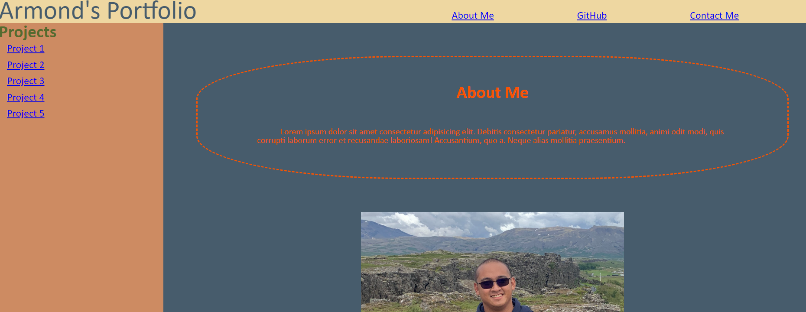

# <Your-Project-Title>

## Description

Personal portfolio page for displaying deployed applications and projects.

## Usage

Click on image for links to deployed project. Find my contact info and github info by clicking on the respective headers.

## License

MIT License
