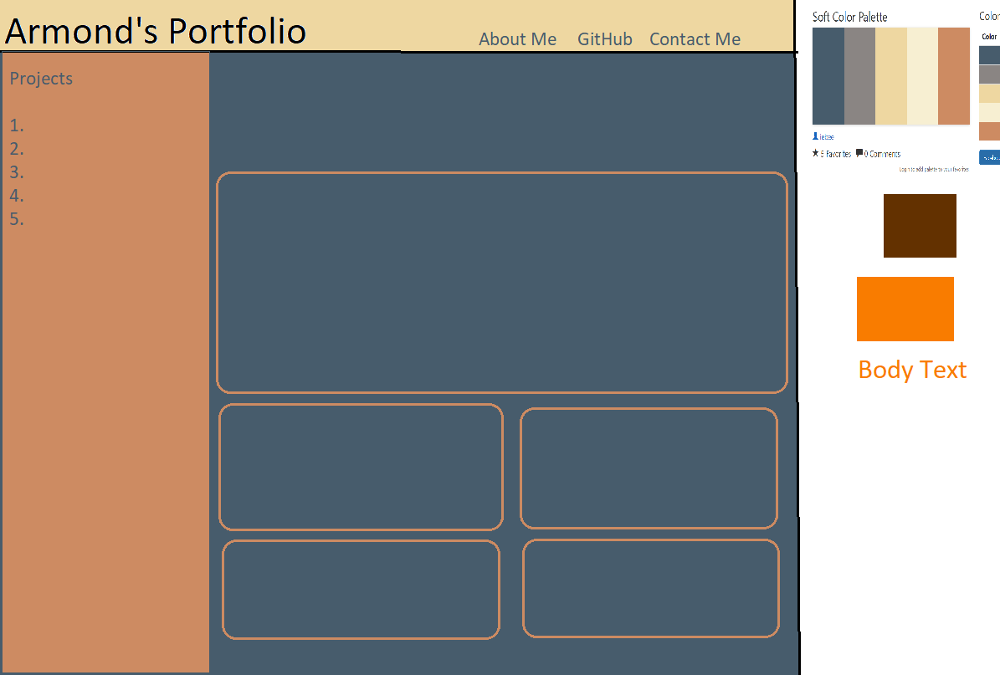

Pseudocode

This portfolio page will have a <header> section containing <name> and <nav>. 
<header> will be a flex container for <name> and <nav>
<nav> will be a flex container for the following
<ul> elements; About Me, GitHub, and Contact Me.

The <main> Section will contain the About Me <section> and the <projects>.
About Me will be a <section> with an <h1> tag followed by 
 for description.
Projects will be <projects> with a <star> tag and multiple  tags. <projects> is a flex container for <star> and 
<star> and  will have similar styling except star will be a larger container.
<star> and  will have <h2> project name, followed by 
 description, and 

The <aside> section will contain <h1> Projects and <nav> with <li> as project names.
<aside> will be a flex container for <h1> and <nav>
<nav> will be a flex container for <li>

The <footer> section will contain <ul> for the following; GitHub, Contact Me.
<footer> will be a flex container for <ul>.

@media screem properties will be added to have the <aside> section move above <main> and have a hover drop down property to reveal the <nav> section.
